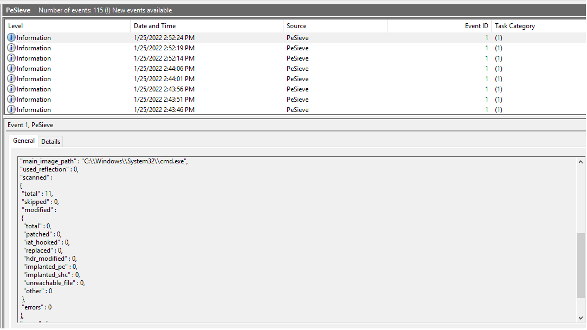
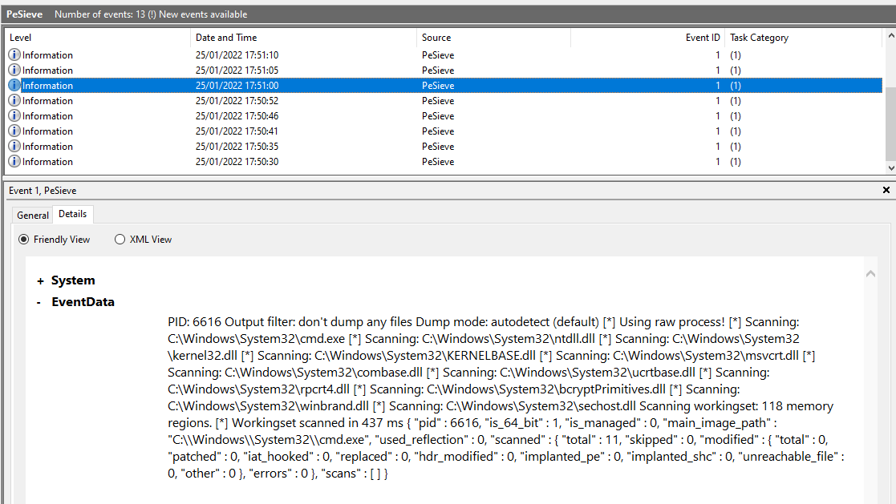

# Pe-SieveToWinEventLog

This repository containing script which allow [pe-sieve](https://github.com/hasherezade/pe-sieve) to log to Windows Event Log so it can be collected for scaled up incident response.

## What is pe-sieve?

From [author's webpage](https://github.com/hasherezade/pe-sieve):

PE-sieve is a tool that helps to detect malware running on the system, as well as to collect the potentially malicious material for further analysis. Recognizes and dumps variety of implants within the scanned process: replaced/injected PEs, shellcodes, hooks, and other in-memory patches.
Detects inline hooks, Process Hollowing, Process Doppelgänging, Reflective DLL Injection, etc.


## Installation Instructions

From an Admin Powershell console run ```.\Install.ps1```. 

## Script Activities:

This script does the following:

* Creates the directory structure at ```c:\Program Files\PeSieve2WindowsEventLog```
* Write PowerShell code buffer to pesieve2wineventlog.ps1 in ```c:\Program Files\PeSieve2WindowsEventLog```
* Downloads pe-sieve.exe from GitHub ```https://github.com/hasherezade/pe-sieve/releases/download/v0.3.3/pe-sieve64.exe```
* Sets up a scheduled task called ```PeSieveToWinEventLog``` to run the script every 3 hours and log to Windows Event Log called 'PeSieve'

## pesieve2wineventlog.ps1 Activities:

* Enumerate all processes 
* For each process ID currently running perform full pe-sieve scan, log details in PeSieve Event Log and log file in ```c:\Program Files\PeSieve2WindowsEventLog\logs```
* Sleep between executions 
* Remove any leftover files from ```c:\Program Files\PeSieve2WindowsEventLog\logs``` folder

## Output 




